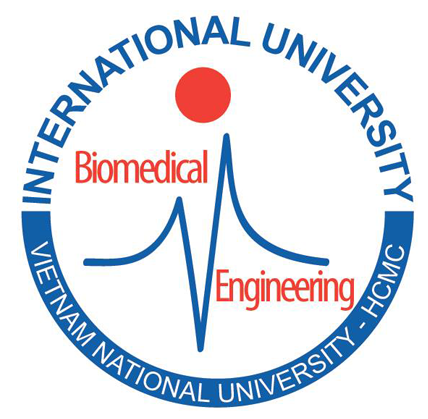
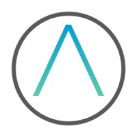



Education 
======
* AICamp, in FPT Software AI Valley, Quy Nhon City, Vietnam, 2022 
* B.S. in Biomedical Engineering, International University - Vietnam National University, 2023 (expected)

Professional summary
======
- Understanding of Machine Learning and Deep Learning. 
- Domain Expertise in the field of Computer Vision in Medical Industry.
- Understand and experience the pipeline of AI production.
- Cooperative and able to perform within a team-oriented atmosphere.
- Good English communication.

Work experience
======
* Sep 2022 - present: AI Engineer 
  * FPT Software 
  * Duties included: Research and build pipeline AI project
  * Skills: Research, review code, communication
  * Technologies: Pytorch, Flask API, Docker, AWS

* July 2021 - April 2023: Machine Learning Intern & Part-time 
  * A2DS (AI-Associated Diagnosis System) 
  * Duties included: 
    * Maintaining the dry eye disease project of A2DS
    * Grasp the end-to-end data collection and processing to web applications for end-users (hospitals)
  * Skills: Research, review code, communication
  * Technologies: Pytorch, Flask API, Postman, Docker, Google Cloud Platform
  
Skills
======

| **Skill**                   | **Experience** | **Last used** | **Description**            |
|-----------------------------|------------|-----------|------------------------------------|
| *Artificial Intelligence*   |------------|-----------|------------------------------------|
| Feature Engineering         | 1 year     | 2023      | Tabular, Text                      |
| Computer Vision             | 1 year     | 2023      | YOLO, Detectron2                   |
| Natural Language Processing | 6 months   | 2023      | Bert, Attention Mechanism, ChatGPT |
| *Frameworks*                |------------|-----------|------------------------------------|
| Pytorch                     | 1 year     | 2022      |                                    |
| Tensorflow/Keras            | 3 months   | 2021      | Tensorflow 2.0                     |
| *Web Development*           |------------| ----------| -----------------------------------|
| FastAPI                     | 6 months   | 2023      |                                    |
| Flask                       | 6 months   | 2023      |                                    |
| *Programming Language*      |------------|-----------|------------------------------------|
| Python                      | 2 years    | 2023      |                                    |
| C++                         | 6 months   | 2021      |                                    |
| SQL                         | 1 year     | 2023      |                                    |
| *Others*                    |------------|-----------|------------------------------------|
| Git                         | 1.5 years  | 2023      | Github, Gitlab, Github Action      |
| Docker                      | 1.5 years  | 2023      | Docker compose                     |
| Amazon Web Service          | 6 months   | 2023      | EC2, S3, Lambda, Sagemaker         |
| Microsoft Azure             | 6 months   | 2023      | Virtual Machine, Azure OpenAI      |
| Google Cloud Platform       | 3 months   | 2021      | Google Cloud Computing             |

Publications
======
  <ul>
    
  </ul>
  
Projects
======
  <ul>
    
  </ul>
  
CV PDF format: <a href="../files/CV_MachineLearningEngineer_VoNguyenKhoi.pdf"> PDF</a>